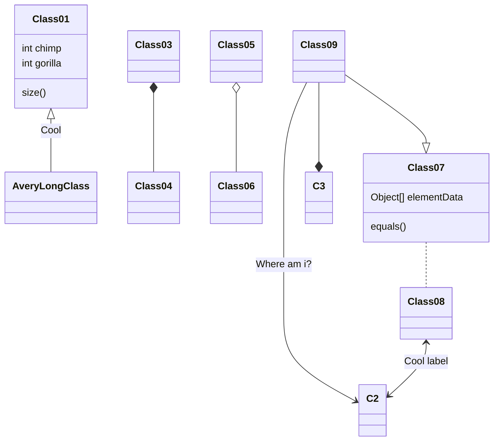

 parovning

Userstory-001
```js
string name = "Salim"
```

=======

Userstory-007
This**word** is bold. This <em>word</em> is italic.

# parovning

## Userstory-006 

### Markdown table

| Syntax      | Description |
| ----------- | ----------- |
| Header      | Title       |
| Paragraph   | Text        |


## Userstory-008

### Emoticon code

` :blush: `

### Emoticon

:blush:


## Userstory-012

### ER-diagram

```mermaid
erDiagram
    CUSTOMER ||--o{ ORDER : places
    CUSTOMER {
        string name
        string custNumber
        string sector
    }
    ORDER ||--|{ LINE-ITEM : contains
    ORDER {
        int orderNumber
        string deliveryAddress
    }
    LINE-ITEM {
        string productCode
        int quantity
        float pricePerUnit
    }=
```
User013

